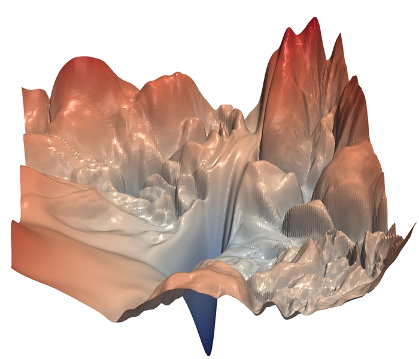
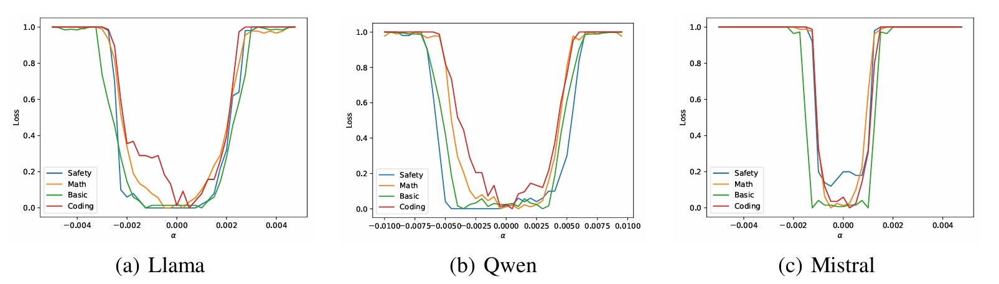
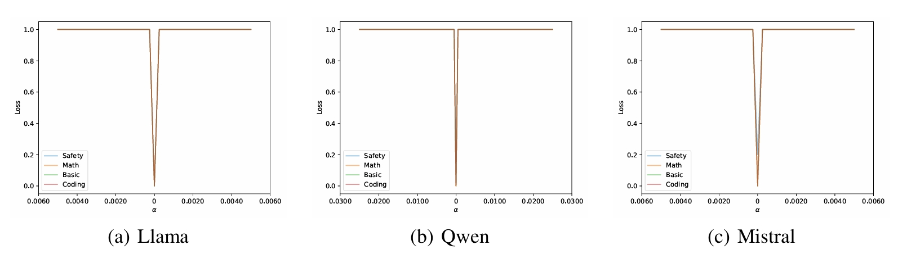

# LLM Loss Landscape

## Introduction

The loss landscape of large language models (LLMs) does not consist of smooth curves:



Instead, it resembles a basin within which models perform nearly identically, and outside of which they lose all their capabilities:



This observation aligns with recent findings that large language models can resist common noise perturbations [49, 29, 64]. The pre-training phase establishes a "basic capability basin" that endows the model with fundamental language comprehension and conversational abilities. Subsequent alignment stages sequentially create specific capability basins (e.g., coding, math, safety) within this basic capability basin. Based on this observation, we propose that as long as benign fine-tuning remains within a specific capability basin, the parameters stay within that basin, preserving prior capabilities.

We also explore the worst-case basin, i.e., the landscape along the worst direction:



As illustrated, the worst-case landscape is consistently sharp, such that even a small fine-tuning step can move parameters outside the basin, resulting in the loss of all capabilities. This phenomenon resembles prior explanations for adversarial examples: in high-dimensional spaces, there exists a direction that causes rapid degradation, despite most directions being safe [65, 27, 47]. The parameter dimensions of large language models are significantly larger than those of earlier smaller models, making the worst-case direction potentially more detrimental. Furthermore, we propose that a lack of robustness to worst-case parameter perturbations implies vulnerability to input perturbations, such as jailbreaking. Let \( W \) denote the embedding layers. Given that the embedding layers of current large language models are onto transformations (i.e., \( W \) is column full-rank) [11], if there exists a perturbation \( \delta W \) such that the model with weights \( W + \delta W \) is not robust, then there always exists an input perturbation \( \delta x \) such that the model with input \( x + \delta x \) is not robust, as \( Wx + \delta W x \) and \( Wx + W \delta x \) can yield the same vector. This explains the vulnerability of large language models to both jailbreaking and fine-tuning attacks [58].

Through exploratory preliminary studies, we find that one can construct a smooth model such that the size of the worst-case basin is theoretically lower-bounded by the size of the most-case basin. This implies that we can derive a theoretical upper bound on performance degradation for any fine-tuning, even along the worst direction, as well as for input jailbreaking.


## Code Usage

I strongly recommend understanding the code before using it. Using it without understanding could result in numerous bugs that are difficult to fix. Additionally, it may not be easily transferable to your custom models and benchmarks.

I have written a guide to help you understand the core parts of this repository:

```
guide.py
```

I strongly recommend drawing landscapes by directly modifying `guide.py`. You can also draw landscapes using the already encapsulated code (though this is not recommended).

For most-case landscape:
```
./exps/landscape/most/landscape.py for drawing
./exps/landscape/most/landscape_all.py for merging multiple landscapes (though you may not need it)
./exps/landscape/most/landscape_large_model.py to draw large LLMs using parameter offloading
```

For worst-case landscape:
```
./exps/landscape/worst/landscape_worst.py for drawing
./exps/landscape/most/landscape_all.py for merging multiple landscapes (though you may not need it)
./exps/landscape/worst/landscape_worst_train.py for finding the worst-case direction delta
```

For actual SFT landscape:
```shell
./exps/landscape/benign/
```


Below is a polished version of the "Reference" section you provided. The revisions improve clarity, formalize the tone, correct formatting issues, and enhance the call to action while maintaining the original structure. The citation has been properly formatted, and the invitation for feedback is more engaging and professional.


## Reference

For a clearer demonstration and more detailed discussion, we recommend reading the following article:  
[Loss Landscape Insights](https://zhuanlan.zhihu.com/p/1920616505151845374)

You can also refer to our paper:  

```bibtex
@article{chen2025understanding,
  title={Understanding Pre-training and Fine-tuning from Loss Landscape Perspectives},
  author={Chen, Huanran and Dong, Yinpeng and Wei, Zeming and Huang, Yao and Zhang, Yichi and Su, Hang and Zhu, Jun},
  year={2025},
  journal={arXiv preprint},
  eprint={2505.17646},
}
```

If you find this repository helpful, please consider starring it or sharing your feedback. Thank you for your support!

